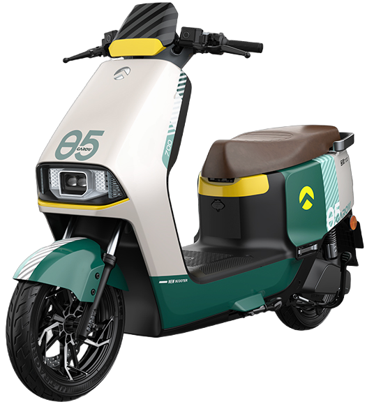

# 金箭超行  
> 利用金箭智行小程序实时获取车辆信息，进行上报和充电控制。

## 项目概述:
金箭超行是一个基于 Python 3.x 的定时任务服务系统，通过金箭智行小程序定时获取车辆信息，并将数据安全地存储在 SQLite 数据库中。项目使用 APScheduler 进行任务调度，FastAPI 提供安全的接口服务。

### 适用车型:
- 星迈75450

### 主要功能:
- 定时任务管理: 使用 APScheduler 定时从金箭智行获取车辆信息，并将数据存储到数据库中。
- 数据存储: 将车辆信息安全地存储在 SQLite 数据库中，为其他项目提供可靠的数据访问。
- 接口服务: 通过 FastAPI 提供安全接口：
  - 获取车辆位置（存在延迟）
  - 获取车辆充电状态
  - 获取车辆电池信息（存在延迟）
  - 获取车辆历史行程
- 充电控制: 通过吉众科技充电桩 API 实现对车辆的充电控制。
- 信息推送: 支持企业微信机器人和钉钉机器人进行信息推送。
- 范围管控: 根据车辆位置实现范围管控：
  - 车辆离开家区域时，自动提醒用户。
  - 车辆进入家区域时，自动提醒用户。
- 配置管理: 用户通过配置 .env 文件参数进行配置，简化部署过程。
  - SMART_CONNECT_ADDRESS : 金箭智行小程序地址
  - SMART_USERNAME : 金箭智行小程序用户名
  - SMART_PASSWORD : 金箭智行小程序密码
  - ROBOT_TYPE : 推送机器人类型
  - ROBOT_TOKEN : 机器人 TOKEN